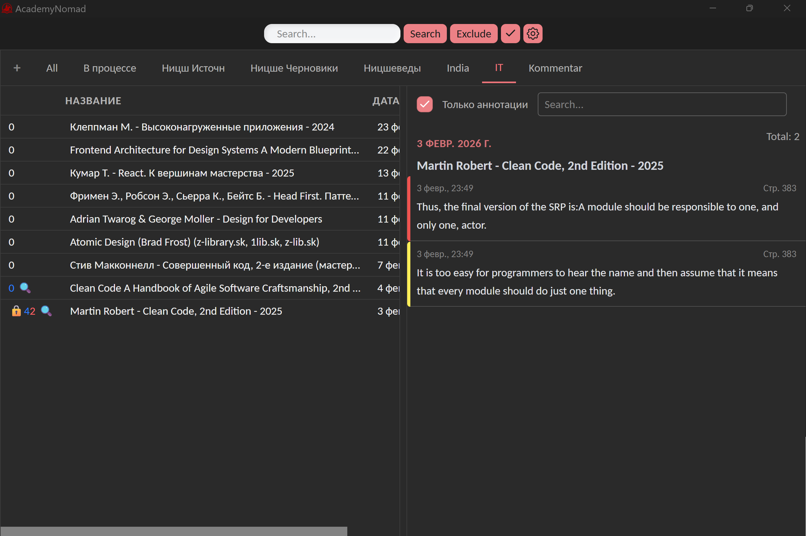
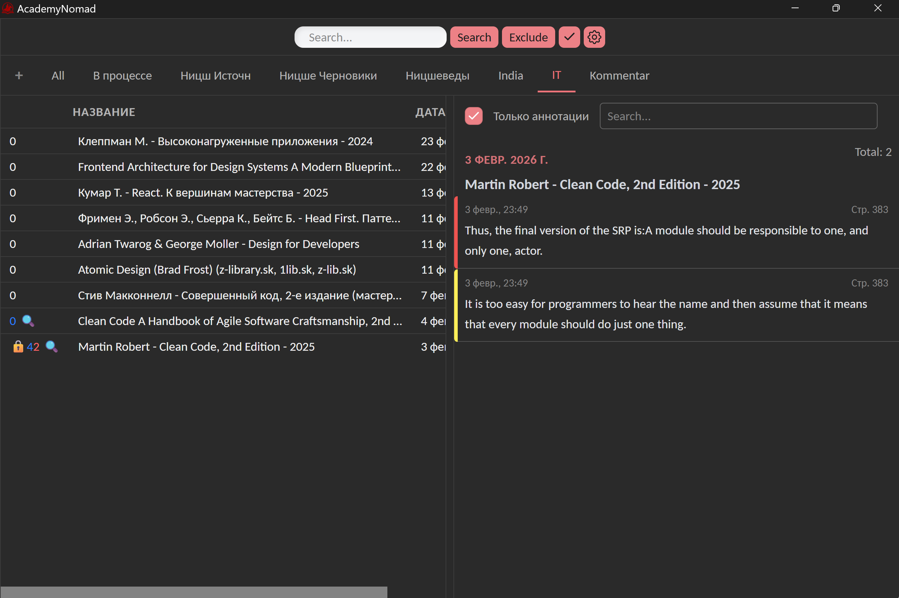

# AcademyNomad

Инструмент для регулярной работы с PDF-файлами. Highly opinionated, поскольку имеет всего одного юзера.

- Показывает все хайлайты последних измененных документов **в системе** (благодаря `Everything SDK`), отсортированные по дате добавления.
- Можно проводить поиск по всем хайлайтам в последних файлах или всех файлах, добавленных в проект.
- Поиск по названиям всех PDF файлов в системе.
- Возможность создавать проекты (списки файлов) с отображением хайлайтов только этих списков.
- При клике на хайлайт открывается документ на нужной странице. Файлы можно открывать по Ctrl+Click в таблице.
- Доставание всех хайлайтов из документа в формате Markdown — пока не реализовано...
- Можно редактировать названия файлов и удалять их через контекстное меню в таблице.
- Можно добавлять файлы и папки с любой вложенностью в исключения (**никогда не показывать**). Например для технических PDF.

## Screenshots

<table style="width:100%;border-collapse:collapse;">
	<tr>
		<td style="width:50%;padding:4px;vertical-align:top;">
			
		</td>
		<td style="width:50%;padding:4px;vertical-align:top;">
			
		</td>
	</tr>
</table>

## Для использования

- **Everything Search** должен быть установлен и запущен. Приложение использует индекс Everything, поэтому на каких дисках искать — указывается в Everything.
- Нужно скачать [.dll Everything SDK](https://www.voidtools.com/support/everything/sdk/) и положить рядом с исполняемым `.exe`
  - Для запуска в dev режиме положить также в папку `src-tauri`
- PDF открываются в приложении по умолчанию. При желании (или проблемах) можно указать путь к исполняемому файлу предпочитаемого приложения.

## Технологический стек

### Frontend
- **React 18** - UI библиотека
- **TypeScript** - Типизация
- **Redux Toolkit** - Управление состоянием
- **Tailwind CSS** - Стилизация

### Backend (Tauri)
- **Tauri 2.6** - Фреймворк для десктопных приложений
- **Rust** - Бэкенд логика
- **Everything-rs** - Интеграция с Everything Search для Windows
- **lopdf** - Парсинг PDF файлов и извлечение хайлайтов

Сборка production версии:

```bash
npm run tauri build
```

Собранное приложение будет находиться в `src-tauri/target/release/`.

## Структура проекта

```
AcademyNomad/
├── src/                          # Frontend код
│   ├── sections/                # Основные секции приложения
│   │   ├── books-section/       # Секция со списком книг
│   │   ├── highlights-section/  # Секция с хайлайтами
│   │   ├── tabs/                # Управление проектами/табами
│   │   ├── top-panel/        # Панель поиска
│   │   ├── modals/              # Модальные окна
│   │   └── settings/            # Настройки
│   ├── shared/                  # Общие компоненты и утилиты
│   │   ├── ui/                  # UI компоненты
│   │   ├── hooks/               # Переиспользуемые хуки
│   │   └── providers/           # React провайдеры
│   ├── redux/                   # Redux store и слайсы
│   │   ├── files/               # Управление файлами
│   │   ├── lists/               # Управление списками/проектами
│   │   └── settings/            # Настройки приложения
│   └── App.tsx                  # Главный компонент
├── src-tauri/                   # Backend код (Rust)
│   ├── src/
│   │   ├── commands/            # Tauri команды
│   │   │   ├── file_commands.rs # Команды для работы с файлами
│   │   │   └── watcher_commands.rs # Команды для отслеживания файлов
│   │   └── lib.rs               # Главный модуль
│   └── tauri.conf.json          # Конфигурация Tauri
├── public/                      # Статические файлы
└── package.json                # Зависимости и скрипты
```

## Механизм работы с хайлайтами

- Everything не умеет доставать хайлайты, они достаются Rust библиотекой довольно долго. Поэтому при поиске обрататываются от 7 до 11 файлов в зависимости от того, есть ли в последних файлах хайлайты (если хайлайтов нет, программа просматривает больше файлов). В остальных файлах не ищутся хайлайты.
- При каждом доставании хайлайты сохраняются локально и потом могут просматриваться. Когда показываются сохраненные хайлайты, число в таблице (сохраненных хайлайтов документа) имеет синий цвет. Это могут быть устаревшие данные. Их можно обновить вручную, нажав на лупу, или они обновятся если файл попадает в число **последних измененных**.