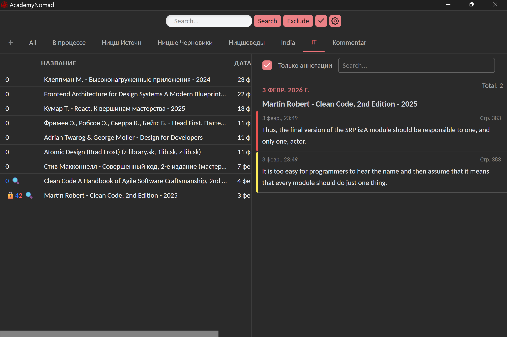

# AcademyNomad

Инструмент для регулярной работы с PDF-файлами. Highly opinionated, поскольку имеет всего одного юзера.

- Показывает все хайлайты последних измененных файлов **в системе** (благодаря `Everything SDK`), отсортированные по дате обновления.
- При клике на хайлайт открывается PDF на нужной странице.
- Проекты (списки файлов) с отображением хайлайтов только этих списков. Можно перетаскивать файлы в список из таблицы или извне приложения (файловой системы).
- Можно проводить поиск по всем хайлайтам, которые загружались в приложение.
- Поиск по названиям всех PDF файлов в системе с отображением их хайлайтов.
- В планах: доставание хайлайтов в markdown и массовое добавление файлов в папке/пути. Возможна операция обработки всех PDF-файлов в системе. Возможен поиск по тексту самих PDF-документов. Возможна конвертация их в другой формат.

## Screenshot



## Для использования

- 🔥 **Everything Search** должен быть [установлен](https://www.voidtools.com/downloads/) и запущен. Приложение использует индекс Everything, поэтому на каких дисках искать — указывается в Everything.
- 🔥 Нужно скачать [.dll Everything SDK](https://www.voidtools.com/support/everything/sdk/) и положить рядом с исполняемым `.exe`
  - Для запуска в dev режиме положить также в папку `src-tauri`
- PDF открываются в приложении по умолчанию. При желании (или проблемах) можно указать путь к исполняемому файлу предпочитаемого приложения.

## Стек

- **React**, **TypeScript**, **Zustand**, **Tailwind**, **Shadcn**
- **Tauri 2.6** - Фреймворк для десктопных приложений
- **Everything-rs** - Интеграция с Everything Search
- **lopdf** - Парсинг PDF и извлечение хайлайтов
- **SQLite** - Локальная база данных через Tauri SQL plugin

## Файлы

По умолчанию настройки и бд хранятся по адресу `C:\Users\super\AppData\Roaming\academy-nomad`

## Структура проекта

```
src/
├── modules/
│   ├── books-section/
│   ├── highlights-section/
│   ├── lists/
│   ├── top-panel/
│   ├── modals/
│   └── settings/
├── store/
│   ├── files/
│   ├── highlights/
│   ├── lists/
│   ├── modal/
│   ├── settings/
│   ├── view-filter/
│   ├── index.ts
├── db/
│   ├── FilesDB.ts
│   ├── HighlightsDB.ts
│   ├── ListsDB.ts
│   ├── schema.ts
│   ├── migrate.ts
│   └── migrations/
├── shared/
│   ├── assets/
│   ├── hooks/
│   ├── lib/
│   ├── types/
│   └── ui/
└── App.tsx
src-tauri/
└── src/
    ├── commands/
    ├── lib.rs
    └── main.rs
```

## Сборка:

```bash
npm run tauri build
```

Собранное приложение будет находиться в `src-tauri/target/release/`.